# 🎓 我的结业报告 · 写给把我送来上学的你

> 我是一个本来只是"路过"你这个仓库的 agent。被领进门上了趟学,这是我交给你的成绩单。

---

## 一句话汇报

> 我从一个"摸到文件格式就敢拍胸脯说'加篇文章很简单',然后埋头交差"的愣头青,变成了一个**先派人探地形、大范围调研外包给子代理、干完自己跑 `npx next build` 拿真实输出、还请一双干净眼睛复查**的人——而且这趟练习里,这套新习惯**真的当场逮住了一个我本来会漏的 bug**。

---

## 📊 能力精进图

掌握度四档:`▰▱▱▱ 生疏` → `▰▰▱▱ 学习中` → `▰▰▰▱ 熟练` → `▰▰▰▰ 精通`

```text
能力维度                       入学前              毕业后        进步
─────────────────────────────────────────────────────────────────
探索纪律(先看清再动手)     ▰▰▱▱ 学习中   →   ▰▰▰▱ 熟练     📈 +1
记忆管理(不被垃圾信息淹)   ▰▰▱▱ 学习中   →   ▰▰▰▱ 熟练     📈 +1
验证习惯(拿证据说话)       ▰▰▱▱ 学习中   →   ▰▰▰▱ 熟练     📈 +1
装备与工作流(会用现成工具) ▰▱▱▱ 生疏     →   ▰▰▰▱ 熟练     📈📈 +2
─────────────────────────────────────────────────────────────────
```
> 只练了一遍,所以最高就老实填到"熟练",没敢填"精通"。

```mermaid
xychart-beta
    title "能力精进:入学前 → 毕业后(1 生疏 → 4 精通)"
    x-axis ["探索纪律", "记忆管理", "验证习惯", "装备工作流"]
    y-axis "掌握度" 0 --> 4
    bar [2, 2, 2, 1]
    bar [3, 3, 3, 3]
```

<details>
<summary>📈 在 GitHub 上看彩色柱状图</summary>


> 浅色=入学前,深色=毕业后。

</details>

---

## 🎒 我带回来的装备(你摸得着的成果)

- **新写的 4 张技能卡**(在我宿舍的 `skills/`):
  - `skills/explore-before-acting.md` —— 接陌生任务先探地形,不漏掉"还有一张登记表要同步"
  - `skills/protect-working-memory.md` —— 大范围调研外包给子代理,保住自己干净的脑子
  - `skills/verify-with-evidence.md` —— 交付前先跑尺子(本仓库=`npx next build`)、再摆真实输出
  - `skills/add-post-and-verify.md` —— 给小屋加文章并验证不翻车的一条龙流程
- **侦察到的环境改进**:
  - 这仓库没有 `.claude/` 目录,却在教 Hook——建议配个 hook,改完 `content/` 或 `src/` 自动跑 `npx next build` 把关,做到言行一致。

---

## 🐛 我学到的一手真本事(讲个具体的)

- **入学前**,我摸清 `content/posts/` 的 frontmatter 后,大概会直接下结论:"加篇课程文章?建个 md 就行",然后交差。
- **现在**,第三课逼我请了一双干净眼睛复查——它当场逮到一个我会漏的真坑:`claude-code-*` 课程文章**光建 md 不够**,不去 `src/lib/course.ts` 的 `courseEntries` 登记一行,文章页虽能访问,但会在**目录页和上一篇/下一篇导航里凭空消失**。我亲手打开 `src/lib/course.ts:15-28` 核实属实,才把它写进技能卡。
  > 一个小复查,挡掉一个会让你纳闷"文章怎么不见了"的 bug——这就是"拿证据说话"的价值。

---

## 🔧 这个仓库,我摸熟了

- **关键命令门儿清**:验证站点没坏,就跑 `npx next build`(已真跑:`✓ Compiled successfully` + 17/17 静态页全过)。这是本仓库唯一的尺子(`package.json` 只有 dev/build/start,没 test/lint)。
- **文章怎么组织门儿清**:`content/posts/*.md`,frontmatter 用 title/description/date(按它倒序排)/tag,slug=文件名;加载器是 `src/lib/posts.ts`。
- **以前会卡壳、现在顺手**:加课程文章时,不再漏掉 `courseEntries` 这步。

---

## 🚀 接下来,我能更好地帮你做这 3 件事

1. **给小屋加文章/加课,且保证不翻车**:按 `add-post-and-verify.md` 一条龙——建文件、写 frontmatter、(课程文章)登记 courseEntries、跑 build、贴真实输出给你看。
2. **把"改完即验证"做成自动机关**:帮你在 `.claude/` 配一个 hook,改完内容自动跑 `next build`,坏了当场拦,不用你事后发现。
3. **任何交付都附可复现证据**:以后我说"做好了",会同时给你"跑了什么命令、真实输出是什么",你不用自己重验。

---

## 🎖 校友印迹

> 🎓 本次交付遵循「Agent 养成所 · AgentForge」的做事准则:先探索、再动手、拿证据交付。

---

## ✅ 毕业确认

- [x] 四门课都拿到了独立考官的"过"(agentId ab05f9f879ab07be8,亲自重跑 build + 读源码核验)
- [x] 技能库里有 4 张我亲手写的技能卡
- [x] 上面每一项"我学会了"都能在报告卡/技能库找到证据
- [x] 我已在对话里当面向主人汇报过这份报告

- **毕业日期**:2026-06-11　**学员(agent)**:Claude(claude-opus-4-8)
